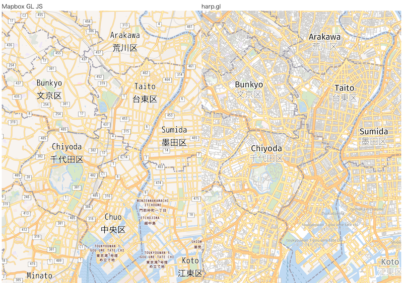

# mapbox2harp

This project is EXPERIMENTAL and under developing.

## Concept

Convert Mapbox-Style to harp.gl-Theme.



## Usage

```typescript

import mapbox2harp from '../../../src';

import { mapstyle } from './style'; //mapbox-style.json

const theme = {
    styles: {
        osm: mapbox2harp(mapstyle as mapboxgl.Style),
    },
    textStyles: [
        {
            name: 'smallSign',
            color: '#000000',
            fontCatalogName: 'fira',
        },
        {
            name: 'smallSignLight',
            color: '#FFFFFF',
            fontCatalogName: 'fira',
        },
        {
            name: 'placeMarker',
            color: '#60FF60',
            fontCatalogName: 'fira',
        },
    ],
    fontCatalogs: [
        {
            name: 'fira',
            url:
                'https://heremaps.github.io/harp-map-editor/fonts/Default_FontCatalog.json',
        },
    ],
};

const dataSource = new OmvDataSource({
    baseUrl: 'https://tile.openstreetmap.jp/data/japan',
    apiFormat: APIFormat.TomtomV1,
    styleSetName: 'osm',
});
map.addDataSource(dataSource);
```